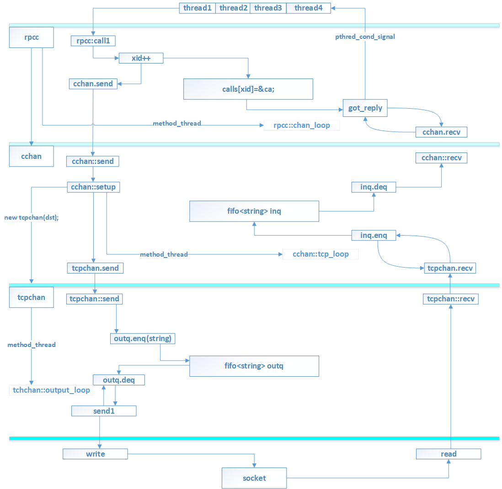

# Lab 1 Lock Server
[TOC]
---
## Step 1

在一个假设完美的网络上实现`lock_server`

   * 使用 RPC system：

     RPC库的源码在`yfs/rpc`中。`lock_server`创建一个监听在指定端口上的``rpc server object`，并且注册各种各样的RPC handlers. `lock_client`创建一个`rpc client object` 

     RPC handler 的最后一个参数可以用来返回运算结果，函数本身返回一个整形的status code。Return zero for success and to return positive numbers otherwise for various error

     RPC system需要知道如何对任意类型的对象进行编码。RPC library已经提供了用于对诸如`std::string, int, char`等标准C++对象进行编码的methods

   * 实现 lock server

     每个lock都有一个`std::stirng`类型的name。如果客户端请求一个之前从未见过的lock，那么就创建该锁，并且将锁授权给客户端。当多个客户端同时请求同一个锁时，服务端必须一次只向一个客户端授权。同时要求所有`lock_server's rpc handler` 都是非阻塞的。
     
## 代码分析  

### rpcs

```c++
rpcs{
    schan chan;
    std::map<int, handler*> procs;
    nonce
}
```
`rpcs`中最重要的字段为`procs`，将 
```c++
rpcs::rpcs(){
    nonce = random();
    method_thread 函数创建线程执行 rpcs::loop
    reg(rpc_const::bind, this, &rpcs::bind);
}

rpcs::loop(){
    while(1){
        chan.recv(req, channo);
        j = new junk(req, channo);
        method_thread 函数创建线程执行 rpcs::dispatch(j)
    }
}

rpcs::dispatch(junk *j){
    j->s >> proc;
    // 根据proc找到handler
    h = procs[proc];
    j->s >> args;
    marshall rep;
    ret = h->fn(args, rep);
    chan.send(rep.str(), channo);
}

rpcs::reg1(unsigned int proc, handler *h){
    procs[proc] = hander;
}
template <class lock_server, class Arg1, class Ret>
void reg(unsigned int proc, lock_server *, int (lock_server::*meth)(const Arg1 a1, Ret &r)){
 // h1 是一个内部类，该类封装了 lock_server 和对应的 method
 // 通过调用 h1 对象的 fn method 就等价于 lock_server_obj.method
 class h1 : public handler {
   private:
    S *sob;
    int (S::*meth)(const A1 a1, R &r);

   public:
    h1(S *xsob, int (S::*xmeth)(const A1 a1, R &r)) : sob(xsob), meth(xmeth) {}

    int fn(unmarshall &args, marshall &ret) {
      A1 a1;
      R r;
      args >> a1;
      if (!args.okdone()) return rpc_const::unmarshal_failure;
      int b = (sob->*meth)(a1, r);
      ret << r;
      return b;
    }
  };
  reg1(proc, new h1(sob, meth));
}
```

`rpcs`构造函数创建线程执行`rpcs::loop`，每当收到rpc请求，`rpc::loop`就新创建一个线程执行`rpc::dispatch`，`dispatch`线程根据`proc`从数组`procs`中找到一个指向`h1`对象的指针`h`，该对象封装了`lock_server`和一个`method`，通过`ret = h->fn(args, rep)`调用`lock_server`的方法。

### rpcc

多个线程可以共享同一个`rpcc`，因此`rpcc`的数据成员会被多个线程共享。

```c++
class rpcc {
 private:
  sockaddr_in dst;  // address of server
  bool debug;
  unsigned int xid;  // xid for next request/call
  std::list<unsigned int> xid_rep_window;

  int svr_nonce;
  int clt_nonce;
  bool bind_done;
  // cchan 负责实际消息的收发
  cchan chan;
  ...

  // clock loop data for tight timeouts
  pthread_mutex_t _timeout_lock;
  pthread_cond_t _timeout_cond;
  ...

  // map xid of awaited reply to waiting thread in call().
  struct caller {
    caller(int xxid, unmarshall *un, uint32_t ip, uint16_t port,
           double when = 0);
    ~caller();
    int xid;
    unmarshall *un;
    int intret;
    bool done;
    pthread_cond_t c;
    pthread_mutex_t m;
    double senttime;
    uint32_t other_ip;
    uint16_t other_port;
  };
  // 线程编号 -> caller对象
  // calling thread waits on caller object after sending RPC request
  std::map<int, caller *> calls;
  pthread_mutex_t m;  // protect insert/delete to calls[]
  pthread_cond_t destroy_wait_c;
  bool destroy_wait;

  pthread_t th_chan_loop;
  pthread_t th_clock_loop;
  void chan_loop();
  void clock_loop();
  void got_reply(unmarshall &rep);
  void update_xid_rep(unsigned int xid);

 public:
  rpcc(sockaddr_in _dst, bool _debug = false);
  ~rpcc();

  void setlossy(bool x);
  void set_vivaldi(vivaldi *v) { _vivaldi = v; }

  // hack to allow optional timeout argument to call().
  struct TO {
    int to;
  };
  static const TO to_inf;
  static TO to(int x) {
    TO t;
    t.to = x;
    return t;
  }
  ...
  int call1(unsigned int proc, const marshall &req, unmarshall &rep, TO to);

  template <class R>
  int call(unsigned int proc, R &r, TO to = to_inf);
  ...
```


```c++
int lock_client::stat(std::string name)
{
  int r;
  // 通过 rpcc 提供的同一的接口进行 rpc
  int ret = cl->call(lock_protocol::stat, id, name, r);
  assert (ret == lock_protocol::OK);
  return r;
} 
```

```c++
template <class R> int rpcc::call(unsigned int proc, R &r, TO to) 
{
  marshall m;
  unmarshall u;
  // 将函数参数编码传给 call1
  int intret = call1(proc, m, u, to);
  ...
  return intret;
}
int rpcc::call1(unsigned int proc, const marshall &req, unmarshall &rep, TO to)
{
  ...  
  // xid 在 rpcc 中唯一标识本次 rpc，等价于给调用者线程编号
  unsigned int myxid = xid++;
  // caller 对象将 xid，用于接收返回值的 rep 封装在一起
  caller ca(myxid, &rep, dst.sin_addr.s_addr, dst.sin_port);
  calls[myxid] = &ca;
  ...
  chan.send(m1.str());
  ...
  // wait for reply or timeout
  assert(pthread_cond_wait(&ca.c, &ca.m) == 0);
  ...
}
```

`rpcc`将单次调用相关的数据结构封装成对象`caller`，通过数组`calls`记录历史调用，以便后面接收到返回值之后能够将返回值传给正确的线程。单次调用没有等到结果之前，该线程将会一直等待(`pthread_cond_wait(&ca.c, &ca.m)`)。以上是`rpcc`发起远程调用的过程。

```c++
rpcc::rpcc(sockaddr_in _dst, bool _debug = false){
    method_thread 创建 rpc::chan_loop
    // clt_nonce 唯一标识 clt 对象
    clt_nonce = random();
    xid_rep_window.push_back(0);
}

// listen for replies, hand to xid's waiting rpcc::call().
rpcc::chan_loop(){
    while(1){
        std::string s = chan.recv();
        unmarshall rep(s);
        got_reply(rep);
    }
}

rpcc::got_reply(unmarshall& rep){
    rep >> xid;
    caller *ca = calls[xid];
    rep >> intret;
    ca->intret = intret;
    pthread_cond_broadcast(&ca->c);
}
```

`rpcc`的构造函数创建线程执行`rpcc::chan_loop`，该函数监听`chan`，将获得的结果解码传递给`rpcc::got_reply`。`rpcc::got_reply`根据`rep`中的`xid`，找到该`rep`的接收对象`caller`，并且通过`pthread_cond_broadcast`唤醒等待结果的线程。以上是`rpcc`接收调用结果的过程。

### lock_client & lock_server

```c++
class lock_client {
 private:
  int rlock_port;
  std::string id;

  rpcc *cl;
  rpcs *rlsrpc;

 public:
  lock_client(std::string xdst);
  ~lock_client() {};

  lock_protocol::status acquire(std::string);
  lock_protocol::status release(std::string);
  lock_protocol::status stat(std::string);

	//RPC handlers for rpc requests from the server
  lock_protocol::status grant(std::string, int &);

};
```

`lock_client`中的`rlsrpc`是一个`rpc server`，用于接收来自`lock_server`的`grant RPC`

```c++
class lock_server {
 private:
  int nacquire;

  std::map<std::string, std::shared_ptr<lock>> lock_map;
  pthread_mutex_t lock_map_m;
  pthread_cond_t lock_map_c;
  
  rpcc* lscl_rpc;

 public:
  lock_server();
  lock_server(std::string xdst);
  lock_protocol::status
      stat(std::string clt, std::string name, int& r);
  lock_protocol::status acquire(std::string clt, std::string lock_name, int& r);
  lock_protocol::status release(std::string clt, std::string lock_name, int& r);
```

在`lock_server`中有一个`rpcc* lscl_rpc`用于向对应的客户端发送`grant RPC`

### cchan schan & tcpchan

```c++
lock_client::lock_client(sting xdst)
    cl = new rpcc(xdst);

rpcc::rpcc(sockaddr_in _dst) : ..., dst(_dst), xid(1), chan(_dst, _debug), ... { ... }

//chan 的类型为 cchan 
cchan::cchan(sockaddr_in _dst) : ..., dst(_dst), ch(0), ... { ... }

//ch 的类型为 tcpchan
tcpchan{
  private:
    int s;
    fifo<string> outq;
   public:
    send(string){ outq.enq(pdu); }
};

tcpchan::tcpchan(int xs) : s(xs){
    method_thread -> output_loop;
}
tcpchan::output_loop(){
    while(1){
      pdu = outq.deq();
      send1(pdu);
    }
}
// output thread
void tcpchan::send1(std::string pdu) {
  unsigned long len = htonl(pdu.size());
  if (write(s, &len, sizeof(len)) != sizeof(len)) {
    perror("tcpchan write");
    die();
  }
  if (write(s, pdu.data(), pdu.size()) != (ssize_t)pdu.size()) {
    perror("tcpchan write");
    die();
  }
}
```

可以看到`rpcc`的初始化过程中并没有真正建立连接，只是将目的端口保存在了`dst`中。`rpcc`初始过程中也并没有创建 tcpchan 实例。

```c++

void cchan::send(std::string pdu) {
  if (setup(dst)) {
    if (lossy_percent) {
      if ((random() % 100) < lossy_percent) {
        return;
      }
      if ((random() % 100) < 10) {
        sleep(random() % 10);  // delay request
      }
      if ((random() % 100) < lossy_percent) {
        ch->send(pdu);
      }
    }
    ch->send(pdu);
  }
}

// setup 函数中创建 socket，并且进行连接
// 连接完成后实例化一个 tcpchan 对象
// 创建 chan::tcp_loop 负责接收消息
bool cchan::setup(sockaddr_in dst){
    ...
  int s;
  s = socket(AF_INET, SOCK_STREAM, 0);
    ...
  connect(s, (sockaddr *)&dst, sizeof(dst)) < 0);
    ...
  ch = new tcpchan(s, debug);
  th = method_thread(this, false, &cchan::tcp_loop);
    ...
}
// copy PDUs from a tcpchan to inq
void cchan::tcp_loop() {
  while (1) {
    // 从 tcpchan::socket 中将数据读入 pdu
    std::string pdu = ch->recv();
    if (ch->dead()) {
      break;
    } else {
      // 将 pdu 中的数据入队列
      inq.enq(pdu);
    }
  }
}
```

当真正通过`cchan::send`发送数据时，`setup`函数：

1. 创建 socket 连接，**实例化一个`tcpchan`对象**
2. 创建`cchan::tcp_loop`线程，该线程负责接收 reply， blocks on `tcpchan`，当收到数据时，就把数据`inq.enq(pdu)`

也就是说，每一次调用`cchan::send`都会创建`socket`，实例化一个 tcpchan 对象，该 tcpchan 对象通过 socket 来进行下一层的 send 与 recv。

`rpcc`的构造函数初始化了`cchan chan`，创建`rpcc::chan_loop`线程，该线程阻塞在`chan.recv()`上，当收到一个响应之后，执行`got_reply`，通过`xid`唤醒请求者线程。将这种线程称为`input_loop`，因为这种线程的作用是等待来自外部的`input`

多个请求者线程共享一个`rpcc`对象，线程调用`rpcc::call`之后，`pthread_cond_wait`，等待自己的返回值到达。

在每次进行`RPC request`时，都会通过`cchan::setup(dst)`来 `new`一个新的`tcpchan`，`tcpchan`的构造函数则是创建一个`tcpchan::output_loop`



### schan
```c++
schan::schan(int port, bool _debug){
  lossy_percent = get_lossy_env();

  // 构造函数中创建 srv socket
  tcp = socket(AF_INET, SOCK_STREAM, 0);
  // 构造函数中 bind and listen
  bing(tcp, (sockaddr *)&sin, sizeof(sin));
  listen(tcp, 1000);
  // 创建 schan::tcp_loop
  th_tcp_loop = method_thread(this, false, &schan::tcp_loop);
}

// schan::tcp_loop
void schan::tcp_loop() {
  int oldstate;
  assert(pthread_setcancelstate(PTHREAD_CANCEL_ENABLE, &oldstate) == 0);

  while (1) {
    sockaddr_in sin;
    socklen_t slen = sizeof(sin);
    // blocks on tcp socket
    // accept 为接收到的请求新创建一个 socket s1
    // s1 用于和客户端通信
    int s1 = accept(tcp, (sockaddr *)&sin, &slen);
    if (s1 < 0) {
      perror("schan accept");
      break;
    }
    method_thread(this, true, &schan::tcp_loop1, s1);
  }
}

// s 对应的 socket 用于发送返回值
void schan::tcp_loop1(int s) {
  ...
  // tcpchan 在 schan中对应收到的一次 rpc 请求
  tcpchan *ch = new tcpchan(s, debug);
  assert(pthread_mutex_lock(&tcpchans_m) == 0);
  // struct channel {
  //   pthread_t th;
  //   tcpchan *ch;
  // }
  // map<int, channel> tcpchans;
  assert(tcpchans.count(s) == 0);
  tcpchans[s].ch = ch;
  tcpchans[s].th = th;
  assert(pthread_mutex_unlock(&tcpchans_m) == 0);

  pthread_cleanup_push(&schan::cleanup_tcp_loop1, (void *)this);

  while (1) {
    std::string pdu = ch->recv();
    if (ch->dead()) break;
    inq.enq(inbuf(pdu, s));
  }
  pthread_cleanup_pop(1);
}
```


### tcpchan

从 cchan::send 过程可以看出，tcpchan 对应一次 rpc 过程，

## Step2

有关`lossy_percent`的代码

```c++
cchan{
  private:
    int lossy_percent;
    ...
};
static int get_lossy_env(){
    char *loss_env = getenv("RPC_LOSSY");
    if(loss_env != NULL){
        int lp = atoi(loss_env);
        if(lp > 0) return lp;
    }
    return 0;
}
cchan::cchan(_dst, -debug=false): ..., lossy_percent(0),...{
    ...
    lossy_percent = get_lossy_env();
}
```

以上是`cchan`中关于`lossy_percent`初始化的代码，初始化是在`cchan`对象构造过程中进行的。

```c++
void cchan::send(std::string pdu) {
  if (setup(dst)) {
    if (lossy_percent) {
      if ((random() % 100) < lossy_percent) {
        return;
      }
      if ((random() % 100) < 10) {
        sleep(random() % 10);  // delay request
      }
      if ((random() % 100) < lossy_percent) {
        ch->send(pdu);
      }
    }
    ch->send(pdu);
  }
}
```

```c++
schan::schan(int port, bool _debug):..., lossy_percent(0),...{
    ...
    lossy_percent = get_lossy_env();
    ...
}
void schan::send(std::string pdu, int channo){
      tcpchan *ch = 0;
  assert(pthread_mutex_lock(&tcpchans_m) == 0);
  if (tcpchans.count(channo) > 0) ch = tcpchans[channo].ch;
  assert(pthread_mutex_unlock(&tcpchans_m) == 0);

  if (!ch) return;

  if (lossy_percent) {
    if ((random() % 100) < lossy_percent) {
      return;
    }
    if ((random() % 100) < 10) {
      sleep(random() % 10);  // delay request
    }
    if ((random() % 100) < lossy_percent) {
      ch->send(pdu);
    }
  }

  ch->send(pdu);
}
```

可以看到，`lossy_percent`的作用主要是在`cchan`和`schan`的发送阶段依概率使得请求被取消、延迟或者重复发送。

`rpcc`类用来充当 RPC 客户端的功能。其核心在于`call1`函数，该函数接收一个被编码过的RPC请求。`call1`函数在被编码过的 RPC 请求中添加了额外的 RPC 字段：

```c++
// add RPC fields before req
ma << clt_nonce << svr_nonce << proc << myxid << xid_rep_window.front() << req.str();
```

这些字段的目的??


`rpcs`类用来完成 RPC server 的功能。它创建一个单独的线程，执行`rpcs::loop`，该线程持续不断地从下层的 TCP channel 中获取 RPC 请求。一旦接收到请求，它就创建一个新线程`rpcs::dispatch`来处理该请求。该函数从请求中抽取出多种 RPC 字段，这些字段包含了足够的信息，用来保证服务端可以消除所有重复的请求。

实现 ai-most-once 传输：
1. 方法一是让 server 记住所有接受过的唯一的 RPC。每个唯一的 RPC 由其 xid 和 clt_nonce 来标记。除了 RPC id 之外，server 还必须记录这些请求对应的回复，这样它就可以 re-send the (potentially lost) reply upon receiving a duplicate request without actually executing the RPC handler. 但是这不是一个完美的方法，因为在这种实现中，用来保存 xid 和回复的内存
2. 更好的方法是是哦那个一个滑动窗口，窗口记录