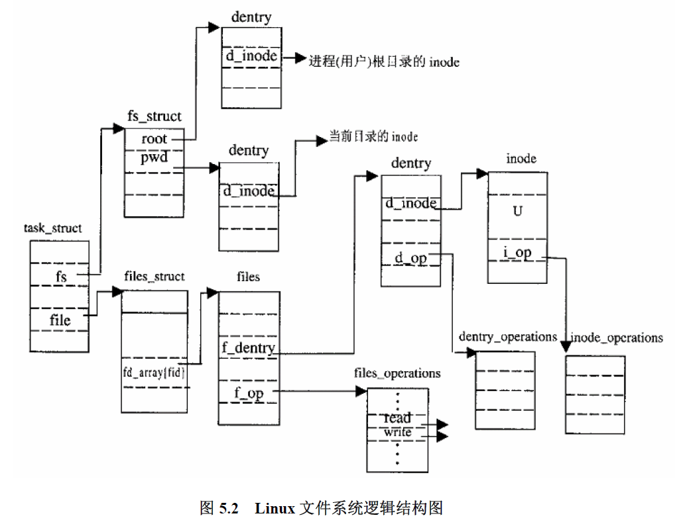
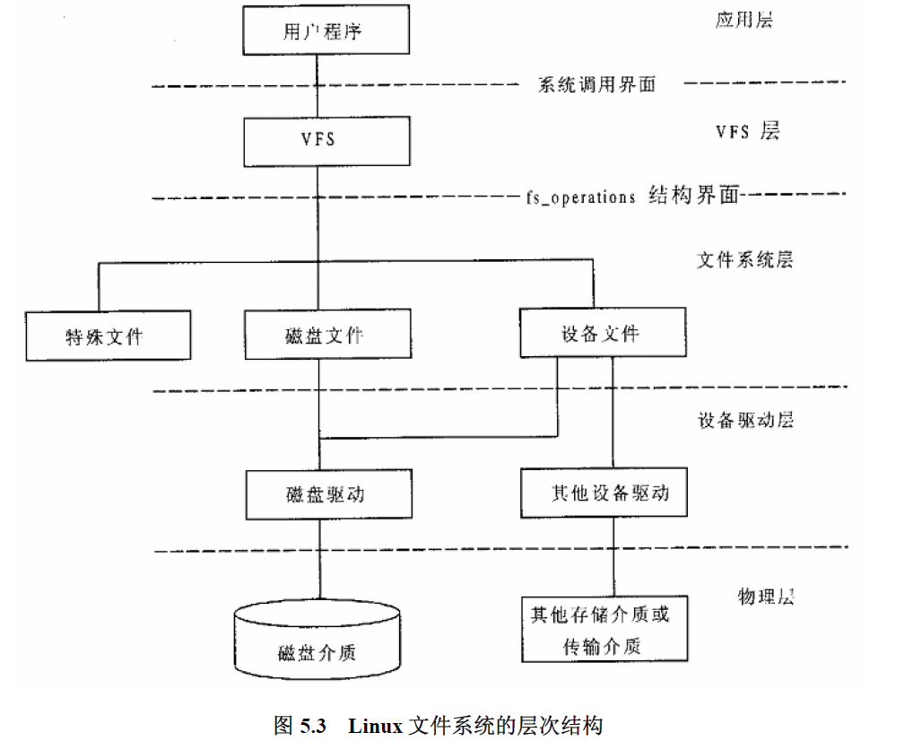

<!-- TOC -->

- [Linux 内核文件系统概述](#linux-%e5%86%85%e6%a0%b8%e6%96%87%e4%bb%b6%e7%b3%bb%e7%bb%9f%e6%a6%82%e8%bf%b0)
  - [VFS](#vfs)
  - [一切皆文件如何实现](#%e4%b8%80%e5%88%87%e7%9a%86%e6%96%87%e4%bb%b6%e5%a6%82%e4%bd%95%e5%ae%9e%e7%8e%b0)
  - [从文件系统到设备驱动](#%e4%bb%8e%e6%96%87%e4%bb%b6%e7%b3%bb%e7%bb%9f%e5%88%b0%e8%ae%be%e5%a4%87%e9%a9%b1%e5%8a%a8)
- [FUSE 基本原理](#fuse-%e5%9f%ba%e6%9c%ac%e5%8e%9f%e7%90%86)
- [FUSE 如何与 yfs 结合](#fuse-%e5%a6%82%e4%bd%95%e4%b8%8e-yfs-%e7%bb%93%e5%90%88)
- [yfs::client](#yfsclient)
- [extent server](#extent-server)

<!-- /TOC -->

## Linux 内核文件系统概述

### VFS

Linux 内核中使用 task_struct 作为进程控制块，其中的 fs_struct 记录了进程的目录上下文，包括根目录、当前目录等。files_struct 结构体的主体就是一个 fd_array，文件通过 open 系统调用返回的文件标识符正是文件对应的 files 结构在 fd_array 中的序号。
1. file: 对应一个进程内打开的逻辑上的文件。file 结构记录了文件在当前进程中的上下文，因此不同进程的 file 文件可以对应相同的客体文件。file 结构体中有一个 f_op 指针，指向客体文件所在文件系统的 files_operation 结构，该结构实际上是一个函数转发表，操作系统对文件执行的系统调用最终都会通过该转发表回调到对应文件系统的实现。file 结构不对应任何磁盘上的数据结构。
2. dentry: 文件在操作系统内核中的上下文，它是内核为构建和访问目录树形结构服务的，是目录与其下文件的缓存。内核中的各个 dentry 在逻辑上的组织结构反映了文件系统目录树的结构。
3. inode: 一个 inode 对应一个客体文件（或目录），记录了文件在磁盘上的分布，以及文件本身的元数据，其与 on-disk 的 inode 对应。

Linux 内核通过 VFS 向上提供统一的文件系统相关系统调用，向下兼容各种不同的文件系统实现。VFS 与不同文件系统之间的通道便是内核中的 struct file_operations 结构
```c
/*
 * NOTE:
 * read, write, poll, fsync, readv, writev can be called
 * without the big kernel lock held in all filesystems.
 */
struct file_operations {
 struct module *owner;
 loff_t (*llseek) (struct file *, loff_t, int);
 ssize_t (*read) (struct file *, char *, size_t, loff_t *);
 ssize_t (*write) (struct file *, const char *, size_t, loff_t *);
 int (*readdir) (struct file *, void *, filldir_t);
 unsigned int (*poll) (struct file *, struct poll_table_struct *);
 int (*ioctl) (struct inode *, struct file *, unsigned int, unsigned long);
 int (*mmap) (struct file *, struct vm_area_struct *);
 int (*open) (struct inode *, struct file *);
 int (*flush) (struct file *);
 int (*release) (struct inode *, struct file *);
 int (*fsync) (struct file *, struct dentry *, int datasync);
 int (*fasync) (int, struct file *, int);
 int (*lock) (struct file *, int, struct file_lock *);
 ssize_t (*readv) (struct file *, const struct iovec *, unsigned long, loff_t *);
 ssize_t (*writev) (struct file *, const struct iovec *, unsigned long, loff_t *);
 };
```
file_operations 相当于一个函数转发表。进程通过 open 系统调用与具体的文件联系起来，即建立一个 file 结构，将其保存在进程的打开文件表中，当进程后续执行比如 read write 等文件系统相关系统调用时，通过 file_operation 来执行对应文件系统对相关系统调用的实现。

事实上，可以看到 file_operations 中的回调函数第一个参数都是 file 结构的指针，可以猜到，file_operations 也是通过 file->dentry->inode，最终执行的还是 inode 结构体中的 inode_operation。

OK，我觉得到现在应该对 Linux 内核中文件系统的静态视图有一个初步的理解了。最关键的就是那几个数据结构。现在论述一下文件系统的动态示图，即一个典型的 write 或者 read 等系统调用到底是如何传递给设备驱动程序的。

### 一切皆文件如何实现

在学习操作系统原理文件部分时，我们知道内核本身在一定程度上可以被看作是一个 IO 软件。内核中的 VFS（之前所说的各种数据结构都属于 VFS 层）就是一个设备独立性软件，所有的 IO 请求最终都需要传递给设备的驱动程序，再传递给设备管理器。而我们经常说，Linux 将设备纳入文件管理，那么这种抽象是如何实现的呢？



事实上，这是通过 inode 这个数据结构实现的。在前面我们都把 inode 近似视为普通文件 on-disk inode 在内核中的复制，认为其中应该记录了数据所在物理块的块号，以及文件本身的元数据等等。现在我们需要再度对 inode 的意义进行抽象，inode 不只是保存索引信息，更是保存管理文件的信息。

当 inode 表示普通文件时，inode 是文件在磁盘上 inode 结构的近似版本；

当 inode 代表设备文件时，比如网卡、GPU设备甚至电机设备，inode 保存的时该设备的管理信息。这些设备之所以能够被视为文件，是因为对他们的使用也是需要进行类似 读/写 这样的操作，需要数据流/块的交换；

inode 表示特殊设备，比如 /dev/null 就表示一个“黑洞”，UNIX域下的 socket 也是一个特殊文件。这些特殊设备并不一定对应一个实体设备，但是对这些特殊设备的使用也是通过信息流交换的形式。

这三种不同的设备都有共同点，就是它们都有需要组织和管理的信息，因此这些设备都可以对应一个内核中的 inode。要“访问”一个文件时，必须通过它的 inode 才知道它的类型（即它位于什么设备之上），通过 inode 才可以知道它的设备驱动程序是什么。

比如当 inode 对应的是文件(磁盘设备)或者设备文件时，inode.i_dev 就表示它的设备类型，那么进一步 inode.i_rdev 就代表设备号。

如果 inode 对应一个普通文件，那么 inode 中的 union 则保存了文件在磁盘上的块号，union 的具体字段与文件系统相关。

当内核找到文件的 inode 结构，通过 inode 得知文件所在的设备类型以及设备号之后，
内核就可以找到对应的设备驱动程序，通过 union 结构体中保存的数据所在的块号，设备驱动程序就可以从磁盘读取指定的数据块，完成文件的读取。

### 从文件系统到设备驱动
实际上，Linux 内核的文件系统和设备驱动之间还有一层抽象接口。文件系统并不是把 read/write 请求发送给对应的设备驱动程序，因为不同设备驱动提供的接口参数并不一定一样，文件系统实现时，并不需要知道设备类型。


文件系统完全不需要知道它究竟在使用哪一个；它只是向一个通用的`block layer`发出一个`block read`或者`block write`指令，`block layer`将这些指令路由到合适的设备驱动，这些设备驱动负责实现具体的动作。   
通过这个图我们还可以发现有一个`raw interface`,用户程序可以通过这个接口来直接读取`blocks`，而无需经过文件系统。我们可以通过这个接口来开发底层存储管理软件。

在实际过程中，还有很多重要的细节，比如 inode 并没有文件名，那么如何通过文件名找到 inode（通过目录系统，根目录 / 作为查找起点），内核对文件的缓存等等。

## FUSE 基本原理

## FUSE 如何与 yfs 结合

## yfs::client

## extent server

